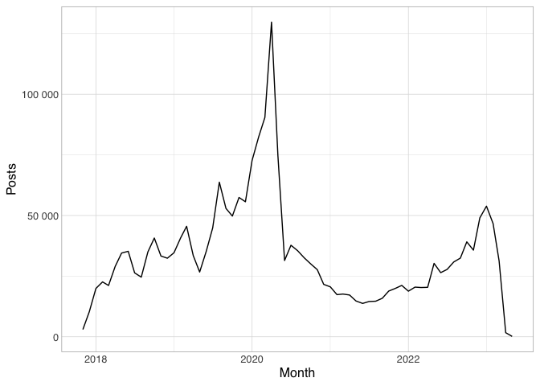
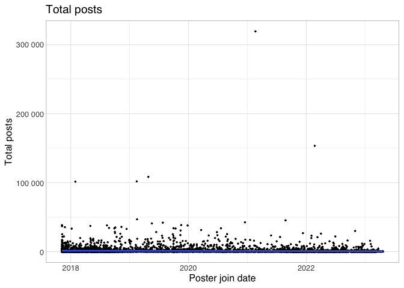
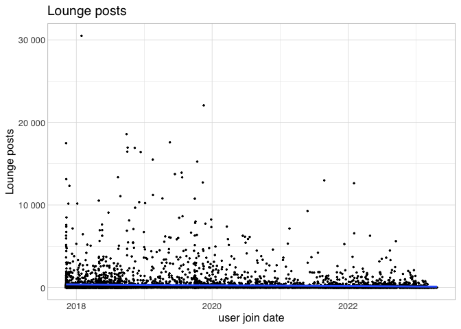
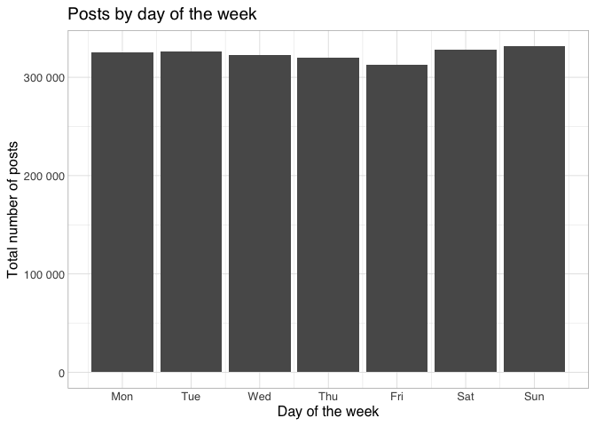
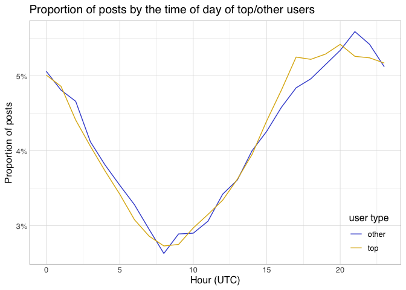
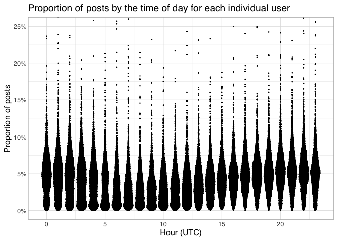
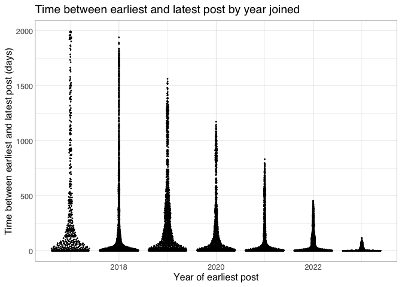

- [Post count distribution through
  time](#post-count-distribution-through-time)
- [Post count distribution
  (overall/lounge)](#post-count-distribution-overalllounge)
- [Interaction between join date and total / lounge
  posts](#interaction-between-join-date-and-total-lounge-posts)
- [Board rhythm](#board-rhythm)
  - [Are there distinct
    subpopulations?](#are-there-distinct-subpopulations)
- [How long are people active by year
  joined](#how-long-are-people-active-by-year-joined)

``` r
library(ggbeeswarm)
```

    ## Loading required package: ggplot2

``` r
library(gt)
source(here::here("src/common_basis.R"))
```

    ## here() starts at /Users/jiemakel/tyo/disc-analysis

    ## ── Attaching core tidyverse packages ──────────────────────── tidyverse 2.0.0 ──
    ## ✔ dplyr     1.1.2     ✔ readr     2.1.4
    ## ✔ forcats   1.0.0     ✔ stringr   1.5.0
    ## ✔ lubridate 1.9.2     ✔ tibble    3.2.1
    ## ✔ purrr     1.0.1     ✔ tidyr     1.3.0
    ## ── Conflicts ────────────────────────────────────────── tidyverse_conflicts() ──
    ## ✖ dplyr::filter() masks stats::filter()
    ## ✖ dplyr::lag()    masks stats::lag()
    ## ℹ Use the conflicted package (<http://conflicted.r-lib.org/>) to force all conflicts to become errors

# Post count distribution through time

``` r
incel_posts_c %>%
  count(year=year(time_posted),month=month(time_posted)) %>%
  mutate(month=as.Date(str_c(year,'-',month,'-01'))) %>%
  ggplot(aes(x=month,y=n)) +
  geom_line() +
  scale_y_continuous(labels=scales::number) + 
  xlab("Month") +
  ylab("Posts") +
  theme_hsci_discrete()
```

<!-- -->

# Post count distribution (overall/lounge)

``` r
quantiles <- seq(0,1,by=0.05)
incel_posters_c %>%
  select(poster_total_posts) %>%
  collect() %>%
  reframe(
    quantile=quantiles,
    poster_total_posts=quantile(poster_total_posts,quantiles)
  ) %>%
  inner_join(
    incel_posts_c %>%
      count(poster_id) %>%
      select(n) %>%
      collect() %>%
      reframe(
        quantile=quantiles,
        poster_lounge_posts=quantile(n,quantiles)
    ),
    join_by(quantile)
  ) %>%
  gt(rowname_col = "quantile") %>%
  fmt_percent(quantile, drop_trailing_zeros = TRUE) %>%
  fmt_number(columns = c(poster_total_posts,poster_lounge_posts), drop_trailing_zeros = TRUE)
```

<div id="ovwunddyla" style="padding-left:0px;padding-right:0px;padding-top:10px;padding-bottom:10px;overflow-x:auto;overflow-y:auto;width:auto;height:auto;">
<style>#ovwunddyla table {
  font-family: system-ui, 'Segoe UI', Roboto, Helvetica, Arial, sans-serif, 'Apple Color Emoji', 'Segoe UI Emoji', 'Segoe UI Symbol', 'Noto Color Emoji';
  -webkit-font-smoothing: antialiased;
  -moz-osx-font-smoothing: grayscale;
}
&#10;#ovwunddyla thead, #ovwunddyla tbody, #ovwunddyla tfoot, #ovwunddyla tr, #ovwunddyla td, #ovwunddyla th {
  border-style: none;
}
&#10;#ovwunddyla p {
  margin: 0;
  padding: 0;
}
&#10;#ovwunddyla .gt_table {
  display: table;
  border-collapse: collapse;
  line-height: normal;
  margin-left: auto;
  margin-right: auto;
  color: #333333;
  font-size: 16px;
  font-weight: normal;
  font-style: normal;
  background-color: #FFFFFF;
  width: auto;
  border-top-style: solid;
  border-top-width: 2px;
  border-top-color: #A8A8A8;
  border-right-style: none;
  border-right-width: 2px;
  border-right-color: #D3D3D3;
  border-bottom-style: solid;
  border-bottom-width: 2px;
  border-bottom-color: #A8A8A8;
  border-left-style: none;
  border-left-width: 2px;
  border-left-color: #D3D3D3;
}
&#10;#ovwunddyla .gt_caption {
  padding-top: 4px;
  padding-bottom: 4px;
}
&#10;#ovwunddyla .gt_title {
  color: #333333;
  font-size: 125%;
  font-weight: initial;
  padding-top: 4px;
  padding-bottom: 4px;
  padding-left: 5px;
  padding-right: 5px;
  border-bottom-color: #FFFFFF;
  border-bottom-width: 0;
}
&#10;#ovwunddyla .gt_subtitle {
  color: #333333;
  font-size: 85%;
  font-weight: initial;
  padding-top: 3px;
  padding-bottom: 5px;
  padding-left: 5px;
  padding-right: 5px;
  border-top-color: #FFFFFF;
  border-top-width: 0;
}
&#10;#ovwunddyla .gt_heading {
  background-color: #FFFFFF;
  text-align: center;
  border-bottom-color: #FFFFFF;
  border-left-style: none;
  border-left-width: 1px;
  border-left-color: #D3D3D3;
  border-right-style: none;
  border-right-width: 1px;
  border-right-color: #D3D3D3;
}
&#10;#ovwunddyla .gt_bottom_border {
  border-bottom-style: solid;
  border-bottom-width: 2px;
  border-bottom-color: #D3D3D3;
}
&#10;#ovwunddyla .gt_col_headings {
  border-top-style: solid;
  border-top-width: 2px;
  border-top-color: #D3D3D3;
  border-bottom-style: solid;
  border-bottom-width: 2px;
  border-bottom-color: #D3D3D3;
  border-left-style: none;
  border-left-width: 1px;
  border-left-color: #D3D3D3;
  border-right-style: none;
  border-right-width: 1px;
  border-right-color: #D3D3D3;
}
&#10;#ovwunddyla .gt_col_heading {
  color: #333333;
  background-color: #FFFFFF;
  font-size: 100%;
  font-weight: normal;
  text-transform: inherit;
  border-left-style: none;
  border-left-width: 1px;
  border-left-color: #D3D3D3;
  border-right-style: none;
  border-right-width: 1px;
  border-right-color: #D3D3D3;
  vertical-align: bottom;
  padding-top: 5px;
  padding-bottom: 6px;
  padding-left: 5px;
  padding-right: 5px;
  overflow-x: hidden;
}
&#10;#ovwunddyla .gt_column_spanner_outer {
  color: #333333;
  background-color: #FFFFFF;
  font-size: 100%;
  font-weight: normal;
  text-transform: inherit;
  padding-top: 0;
  padding-bottom: 0;
  padding-left: 4px;
  padding-right: 4px;
}
&#10;#ovwunddyla .gt_column_spanner_outer:first-child {
  padding-left: 0;
}
&#10;#ovwunddyla .gt_column_spanner_outer:last-child {
  padding-right: 0;
}
&#10;#ovwunddyla .gt_column_spanner {
  border-bottom-style: solid;
  border-bottom-width: 2px;
  border-bottom-color: #D3D3D3;
  vertical-align: bottom;
  padding-top: 5px;
  padding-bottom: 5px;
  overflow-x: hidden;
  display: inline-block;
  width: 100%;
}
&#10;#ovwunddyla .gt_spanner_row {
  border-bottom-style: hidden;
}
&#10;#ovwunddyla .gt_group_heading {
  padding-top: 8px;
  padding-bottom: 8px;
  padding-left: 5px;
  padding-right: 5px;
  color: #333333;
  background-color: #FFFFFF;
  font-size: 100%;
  font-weight: initial;
  text-transform: inherit;
  border-top-style: solid;
  border-top-width: 2px;
  border-top-color: #D3D3D3;
  border-bottom-style: solid;
  border-bottom-width: 2px;
  border-bottom-color: #D3D3D3;
  border-left-style: none;
  border-left-width: 1px;
  border-left-color: #D3D3D3;
  border-right-style: none;
  border-right-width: 1px;
  border-right-color: #D3D3D3;
  vertical-align: middle;
  text-align: left;
}
&#10;#ovwunddyla .gt_empty_group_heading {
  padding: 0.5px;
  color: #333333;
  background-color: #FFFFFF;
  font-size: 100%;
  font-weight: initial;
  border-top-style: solid;
  border-top-width: 2px;
  border-top-color: #D3D3D3;
  border-bottom-style: solid;
  border-bottom-width: 2px;
  border-bottom-color: #D3D3D3;
  vertical-align: middle;
}
&#10;#ovwunddyla .gt_from_md > :first-child {
  margin-top: 0;
}
&#10;#ovwunddyla .gt_from_md > :last-child {
  margin-bottom: 0;
}
&#10;#ovwunddyla .gt_row {
  padding-top: 8px;
  padding-bottom: 8px;
  padding-left: 5px;
  padding-right: 5px;
  margin: 10px;
  border-top-style: solid;
  border-top-width: 1px;
  border-top-color: #D3D3D3;
  border-left-style: none;
  border-left-width: 1px;
  border-left-color: #D3D3D3;
  border-right-style: none;
  border-right-width: 1px;
  border-right-color: #D3D3D3;
  vertical-align: middle;
  overflow-x: hidden;
}
&#10;#ovwunddyla .gt_stub {
  color: #333333;
  background-color: #FFFFFF;
  font-size: 100%;
  font-weight: initial;
  text-transform: inherit;
  border-right-style: solid;
  border-right-width: 2px;
  border-right-color: #D3D3D3;
  padding-left: 5px;
  padding-right: 5px;
}
&#10;#ovwunddyla .gt_stub_row_group {
  color: #333333;
  background-color: #FFFFFF;
  font-size: 100%;
  font-weight: initial;
  text-transform: inherit;
  border-right-style: solid;
  border-right-width: 2px;
  border-right-color: #D3D3D3;
  padding-left: 5px;
  padding-right: 5px;
  vertical-align: top;
}
&#10;#ovwunddyla .gt_row_group_first td {
  border-top-width: 2px;
}
&#10;#ovwunddyla .gt_row_group_first th {
  border-top-width: 2px;
}
&#10;#ovwunddyla .gt_summary_row {
  color: #333333;
  background-color: #FFFFFF;
  text-transform: inherit;
  padding-top: 8px;
  padding-bottom: 8px;
  padding-left: 5px;
  padding-right: 5px;
}
&#10;#ovwunddyla .gt_first_summary_row {
  border-top-style: solid;
  border-top-color: #D3D3D3;
}
&#10;#ovwunddyla .gt_first_summary_row.thick {
  border-top-width: 2px;
}
&#10;#ovwunddyla .gt_last_summary_row {
  padding-top: 8px;
  padding-bottom: 8px;
  padding-left: 5px;
  padding-right: 5px;
  border-bottom-style: solid;
  border-bottom-width: 2px;
  border-bottom-color: #D3D3D3;
}
&#10;#ovwunddyla .gt_grand_summary_row {
  color: #333333;
  background-color: #FFFFFF;
  text-transform: inherit;
  padding-top: 8px;
  padding-bottom: 8px;
  padding-left: 5px;
  padding-right: 5px;
}
&#10;#ovwunddyla .gt_first_grand_summary_row {
  padding-top: 8px;
  padding-bottom: 8px;
  padding-left: 5px;
  padding-right: 5px;
  border-top-style: double;
  border-top-width: 6px;
  border-top-color: #D3D3D3;
}
&#10;#ovwunddyla .gt_last_grand_summary_row_top {
  padding-top: 8px;
  padding-bottom: 8px;
  padding-left: 5px;
  padding-right: 5px;
  border-bottom-style: double;
  border-bottom-width: 6px;
  border-bottom-color: #D3D3D3;
}
&#10;#ovwunddyla .gt_striped {
  background-color: rgba(128, 128, 128, 0.05);
}
&#10;#ovwunddyla .gt_table_body {
  border-top-style: solid;
  border-top-width: 2px;
  border-top-color: #D3D3D3;
  border-bottom-style: solid;
  border-bottom-width: 2px;
  border-bottom-color: #D3D3D3;
}
&#10;#ovwunddyla .gt_footnotes {
  color: #333333;
  background-color: #FFFFFF;
  border-bottom-style: none;
  border-bottom-width: 2px;
  border-bottom-color: #D3D3D3;
  border-left-style: none;
  border-left-width: 2px;
  border-left-color: #D3D3D3;
  border-right-style: none;
  border-right-width: 2px;
  border-right-color: #D3D3D3;
}
&#10;#ovwunddyla .gt_footnote {
  margin: 0px;
  font-size: 90%;
  padding-top: 4px;
  padding-bottom: 4px;
  padding-left: 5px;
  padding-right: 5px;
}
&#10;#ovwunddyla .gt_sourcenotes {
  color: #333333;
  background-color: #FFFFFF;
  border-bottom-style: none;
  border-bottom-width: 2px;
  border-bottom-color: #D3D3D3;
  border-left-style: none;
  border-left-width: 2px;
  border-left-color: #D3D3D3;
  border-right-style: none;
  border-right-width: 2px;
  border-right-color: #D3D3D3;
}
&#10;#ovwunddyla .gt_sourcenote {
  font-size: 90%;
  padding-top: 4px;
  padding-bottom: 4px;
  padding-left: 5px;
  padding-right: 5px;
}
&#10;#ovwunddyla .gt_left {
  text-align: left;
}
&#10;#ovwunddyla .gt_center {
  text-align: center;
}
&#10;#ovwunddyla .gt_right {
  text-align: right;
  font-variant-numeric: tabular-nums;
}
&#10;#ovwunddyla .gt_font_normal {
  font-weight: normal;
}
&#10;#ovwunddyla .gt_font_bold {
  font-weight: bold;
}
&#10;#ovwunddyla .gt_font_italic {
  font-style: italic;
}
&#10;#ovwunddyla .gt_super {
  font-size: 65%;
}
&#10;#ovwunddyla .gt_footnote_marks {
  font-size: 75%;
  vertical-align: 0.4em;
  position: initial;
}
&#10;#ovwunddyla .gt_asterisk {
  font-size: 100%;
  vertical-align: 0;
}
&#10;#ovwunddyla .gt_indent_1 {
  text-indent: 5px;
}
&#10;#ovwunddyla .gt_indent_2 {
  text-indent: 10px;
}
&#10;#ovwunddyla .gt_indent_3 {
  text-indent: 15px;
}
&#10;#ovwunddyla .gt_indent_4 {
  text-indent: 20px;
}
&#10;#ovwunddyla .gt_indent_5 {
  text-indent: 25px;
}
</style>
<table class="gt_table" data-quarto-disable-processing="false" data-quarto-bootstrap="false">
  <thead>
    &#10;    <tr class="gt_col_headings">
      <th class="gt_col_heading gt_columns_bottom_border gt_left" rowspan="1" colspan="1" scope="col" id=""></th>
      <th class="gt_col_heading gt_columns_bottom_border gt_right" rowspan="1" colspan="1" scope="col" id="poster_total_posts">poster_total_posts</th>
      <th class="gt_col_heading gt_columns_bottom_border gt_right" rowspan="1" colspan="1" scope="col" id="poster_lounge_posts">poster_lounge_posts</th>
    </tr>
  </thead>
  <tbody class="gt_table_body">
    <tr><th id="stub_1_1" scope="row" class="gt_row gt_right gt_stub">0%</th>
<td headers="stub_1_1 poster_total_posts" class="gt_row gt_right">0</td>
<td headers="stub_1_1 poster_lounge_posts" class="gt_row gt_right">1</td></tr>
    <tr><th id="stub_1_2" scope="row" class="gt_row gt_right gt_stub">5%</th>
<td headers="stub_1_2 poster_total_posts" class="gt_row gt_right">2</td>
<td headers="stub_1_2 poster_lounge_posts" class="gt_row gt_right">1</td></tr>
    <tr><th id="stub_1_3" scope="row" class="gt_row gt_right gt_stub">10%</th>
<td headers="stub_1_3 poster_total_posts" class="gt_row gt_right">5</td>
<td headers="stub_1_3 poster_lounge_posts" class="gt_row gt_right">1</td></tr>
    <tr><th id="stub_1_4" scope="row" class="gt_row gt_right gt_stub">15%</th>
<td headers="stub_1_4 poster_total_posts" class="gt_row gt_right">8</td>
<td headers="stub_1_4 poster_lounge_posts" class="gt_row gt_right">1</td></tr>
    <tr><th id="stub_1_5" scope="row" class="gt_row gt_right gt_stub">20%</th>
<td headers="stub_1_5 poster_total_posts" class="gt_row gt_right">12</td>
<td headers="stub_1_5 poster_lounge_posts" class="gt_row gt_right">2</td></tr>
    <tr><th id="stub_1_6" scope="row" class="gt_row gt_right gt_stub">25%</th>
<td headers="stub_1_6 poster_total_posts" class="gt_row gt_right">18</td>
<td headers="stub_1_6 poster_lounge_posts" class="gt_row gt_right">3</td></tr>
    <tr><th id="stub_1_7" scope="row" class="gt_row gt_right gt_stub">30%</th>
<td headers="stub_1_7 poster_total_posts" class="gt_row gt_right">26</td>
<td headers="stub_1_7 poster_lounge_posts" class="gt_row gt_right">4</td></tr>
    <tr><th id="stub_1_8" scope="row" class="gt_row gt_right gt_stub">35%</th>
<td headers="stub_1_8 poster_total_posts" class="gt_row gt_right">36</td>
<td headers="stub_1_8 poster_lounge_posts" class="gt_row gt_right">5</td></tr>
    <tr><th id="stub_1_9" scope="row" class="gt_row gt_right gt_stub">40%</th>
<td headers="stub_1_9 poster_total_posts" class="gt_row gt_right">50</td>
<td headers="stub_1_9 poster_lounge_posts" class="gt_row gt_right">6</td></tr>
    <tr><th id="stub_1_10" scope="row" class="gt_row gt_right gt_stub">45%</th>
<td headers="stub_1_10 poster_total_posts" class="gt_row gt_right">69</td>
<td headers="stub_1_10 poster_lounge_posts" class="gt_row gt_right">8</td></tr>
    <tr><th id="stub_1_11" scope="row" class="gt_row gt_right gt_stub">50%</th>
<td headers="stub_1_11 poster_total_posts" class="gt_row gt_right">95.5</td>
<td headers="stub_1_11 poster_lounge_posts" class="gt_row gt_right">12</td></tr>
    <tr><th id="stub_1_12" scope="row" class="gt_row gt_right gt_stub">55%</th>
<td headers="stub_1_12 poster_total_posts" class="gt_row gt_right">126</td>
<td headers="stub_1_12 poster_lounge_posts" class="gt_row gt_right">16</td></tr>
    <tr><th id="stub_1_13" scope="row" class="gt_row gt_right gt_stub">60%</th>
<td headers="stub_1_13 poster_total_posts" class="gt_row gt_right">177</td>
<td headers="stub_1_13 poster_lounge_posts" class="gt_row gt_right">22</td></tr>
    <tr><th id="stub_1_14" scope="row" class="gt_row gt_right gt_stub">65%</th>
<td headers="stub_1_14 poster_total_posts" class="gt_row gt_right">247</td>
<td headers="stub_1_14 poster_lounge_posts" class="gt_row gt_right">31</td></tr>
    <tr><th id="stub_1_15" scope="row" class="gt_row gt_right gt_stub">70%</th>
<td headers="stub_1_15 poster_total_posts" class="gt_row gt_right">353</td>
<td headers="stub_1_15 poster_lounge_posts" class="gt_row gt_right">47</td></tr>
    <tr><th id="stub_1_16" scope="row" class="gt_row gt_right gt_stub">75%</th>
<td headers="stub_1_16 poster_total_posts" class="gt_row gt_right">536</td>
<td headers="stub_1_16 poster_lounge_posts" class="gt_row gt_right">74</td></tr>
    <tr><th id="stub_1_17" scope="row" class="gt_row gt_right gt_stub">80%</th>
<td headers="stub_1_17 poster_total_posts" class="gt_row gt_right">802.4</td>
<td headers="stub_1_17 poster_lounge_posts" class="gt_row gt_right">122</td></tr>
    <tr><th id="stub_1_18" scope="row" class="gt_row gt_right gt_stub">85%</th>
<td headers="stub_1_18 poster_total_posts" class="gt_row gt_right">1,337.65</td>
<td headers="stub_1_18 poster_lounge_posts" class="gt_row gt_right">228</td></tr>
    <tr><th id="stub_1_19" scope="row" class="gt_row gt_right gt_stub">90%</th>
<td headers="stub_1_19 poster_total_posts" class="gt_row gt_right">2,373.1</td>
<td headers="stub_1_19 poster_lounge_posts" class="gt_row gt_right">460</td></tr>
    <tr><th id="stub_1_20" scope="row" class="gt_row gt_right gt_stub">95%</th>
<td headers="stub_1_20 poster_total_posts" class="gt_row gt_right">5,339</td>
<td headers="stub_1_20 poster_lounge_posts" class="gt_row gt_right">1,223.65</td></tr>
    <tr><th id="stub_1_21" scope="row" class="gt_row gt_right gt_stub">100%</th>
<td headers="stub_1_21 poster_total_posts" class="gt_row gt_right">319,186</td>
<td headers="stub_1_21 poster_lounge_posts" class="gt_row gt_right">30,485</td></tr>
  </tbody>
  &#10;  
</table>
</div>

- As expected, the distribution is very skewed. Half the posters have
  less than 100 posts, while the top 25% have more than 500.

# Interaction between join date and total / lounge posts

``` r
incel_posters_c %>%
  filter(poster_joined>"1970-01-01") %>%
  ggplot(aes(x=poster_joined,y=poster_total_posts)) +
  geom_point(size=0.5) +
  geom_smooth(method="lm", formula="y~x") +
  theme_hsci_discrete() +
  scale_y_continuous(labels=scales::number) +
  xlab("Poster join date") +
  ylab("Total posts") +
  ggtitle("Total posts")
```

<!-- -->

``` r
incel_posts_c %>%
  count(poster_id) %>%
  inner_join(incel_posters_c, join_by(poster_id)) %>%
  filter(poster_joined>"1970-01-01") %>%
  ggplot(aes(x=poster_joined,y=n)) +
  geom_point(size=0.5) +
  geom_smooth(method="lm", formula="y~x") +
  theme_hsci_discrete() +
  scale_y_continuous(labels=scales::number) +
  xlab("Poster join date") +
  ylab("Lounge posts") +
  ggtitle("Lounge posts")
```

<!-- -->

- The earlier you join, the more likely you are to have more posts, but
  there doesn’t seem to be a discernible pattern for when the real
  “heavy hitters” have joined.

# Board rhythm

``` r
incel_posts_c %>% 
  mutate(hour=hour(time_posted),weekday=weekday(time_posted)) %>%
  count(weekday,hour) %>%
  ggplot(aes(x=hour,y=n,color=as_factor(weekday))) +
  geom_line() +
  theme_hsci_discrete() +
  theme(
    legend.justification = c(1, 0), 
    legend.position = c(0.98, 0.02), 
    legend.background = element_blank(), 
    legend.key = element_blank()) +
  xlab("Hour (UTC)") +
  ylab("Total number of posts") +
  labs(color="Day of the week") +
  ggtitle("Posts by the time of day")
```

<!-- -->

``` r
weekdays <- tribble(~index,~weekday,
                    0,"Mon",
                    1,"Tue",
                    2,"Wed",
                    3,"Thu",
                    4,"Fri",
                    5,"Sat",
                    6,"Sun")
incel_posts_c %>% 
  mutate(weekday=weekday(time_posted)) %>%
  count(weekday) %>%
  ggplot(aes(x=weekday,y=n)) +
  geom_col() +
  theme_hsci_discrete() +
  scale_x_continuous(breaks=weekdays$index, labels=weekdays$weekday) +
  scale_y_continuous(labels=scales::number) +
  xlab("Day of the week") +
  ylab("Total number of posts") +
  ggtitle("Posts by day of the week")
```

<!-- -->

``` r
poster_type <- incel_posts_c %>%
  count(poster_id) %>%
  mutate(poster_type=if_else(n>=100,"top","other")) %>%
  select(poster_id, poster_type)

incel_posts_c %>% 
  mutate(hour=hour(time_posted)) %>%
  inner_join(poster_type, join_by(poster_id)) %>%
  count(poster_type,hour) %>%
  group_by(poster_type) %>%
  mutate(proportion=n/sum(n)) %>%
  ungroup() %>%
  ggplot(aes(x=hour,y=proportion,color=poster_type)) +
  geom_line() +
  theme_hsci_discrete() +
  theme(
    legend.justification = c(1, 0), 
    legend.position = c(0.98, 0.02), 
    legend.background = element_blank(), 
    legend.box.just = "bottom", 
    legend.key = element_blank(), 
    legend.box = "horizontal") +
  scale_y_continuous(labels=scales::percent_format(accuracy=1)) +
  xlab("Hour (UTC)") +
  ylab("Proportion of posts") +
  labs(color="Poster type") +
  ggtitle("Proportion of posts by the time of day of top/other users")
```

    ## Warning: Missing values are always removed in SQL aggregation functions.
    ## Use `na.rm = TRUE` to silence this warning
    ## This warning is displayed once every 8 hours.

<!-- -->

- There doesn’t seem to be a difference in daily rhythms between top
  posters and others.
- Interestingly, no big differences by day of week
- How international is the forum?

## Are there distinct subpopulations?

``` r
incel_posts_c %>% 
  mutate(hour=hour(time_posted)) %>%
  count(poster_id,hour) %>%
  group_by(poster_id) %>%
  filter(sum(n)>=100) %>% # limit to users with enough data to get any pattern
  mutate(proportion=n/sum(n)) %>%
  ungroup() %>%
  ggplot(aes(x=hour,y=proportion)) +
  geom_quasirandom(size=0.25) +
  coord_cartesian(ylim=c(0,0.25)) +
  theme_hsci_discrete() +
  scale_y_continuous(labels=scales::percent_format(accuracy=1)) +
  xlab("Hour (UTC)") +
  ylab("Proportion of posts") +
  labs(color="Poster type") +
  ggtitle("Proportion of posts by the time of day for each individual user")
```

<!-- -->

- There do not seem to be clearly distinct time profiles with large
  groups of users. There may be some variation in UTC night time posting
  behaviour (3-12 UTC)

# How long are people active by year joined

``` r
incel_posts_c %>%
    group_by(poster_id) %>%
    summarise(earliest_post=min(time_posted),latest_post=max(time_posted), .groups="drop") %>%
    mutate(earliest_post_year=year(earliest_post), active_period_days=sql("timestampdiff(day,earliest_post,latest_post)")) %>%
  ggplot(aes(x=earliest_post_year,y=active_period_days)) + 
  geom_quasirandom(size=0.25) +
  theme_hsci_discrete() +
  xlab("Year of earliest post") +
  ylab("Time between earliest and latest post (days)") +
  ggtitle("Time between earliest and latest post by year joined")
```

<!-- -->

- In 2019, there seem to have been more people joining who stayed on
  longer.
