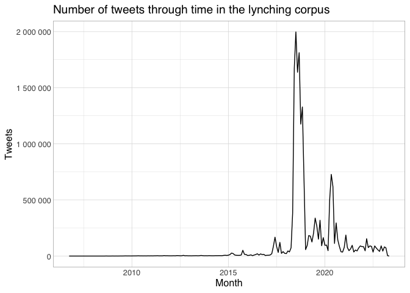
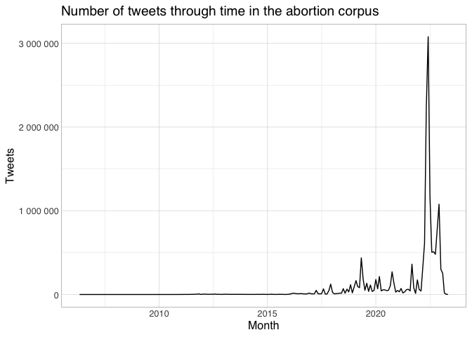

- [Monologues, dialogues and trialogues in the lynching
  corpus](#monologues-dialogues-and-trialogues-in-the-lynching-corpus)
  - [Overall](#overall)
  - [When the middle tweet contains
    fuck\*](#when-the-middle-tweet-contains-fuck)

``` r
library(ggbeeswarm)
```

    ## Loading required package: ggplot2

``` r
library(gt)
source(here::here("src/common_basis.R"))
```

    ## here() starts at /Users/jiemakel/tyo/disc-analysis

    ## ── Attaching core tidyverse packages ──────────────────────── tidyverse 2.0.0 ──
    ## ✔ dplyr     1.1.2     ✔ readr     2.1.4
    ## ✔ forcats   1.0.0     ✔ stringr   1.5.0
    ## ✔ lubridate 1.9.2     ✔ tibble    3.2.1
    ## ✔ purrr     1.0.1     ✔ tidyr     1.3.0
    ## ── Conflicts ────────────────────────────────────────── tidyverse_conflicts() ──
    ## ✖ dplyr::filter() masks stats::filter()
    ## ✖ dplyr::lag()    masks stats::lag()
    ## ℹ Use the conflicted package (<http://conflicted.r-lib.org/>) to force all conflicts to become errors

``` r
lynching_tweets_a %>%
  count(year_created_at,month_created_at) %>%
  mutate(month=as.Date(str_c(year_created_at,'-',month_created_at,'-01'))) %>%
  ggplot(aes(x=month,y=n)) +
  geom_line() +
  scale_y_continuous(labels=scales::number) + 
  xlab("Month") +
  ylab("Tweets") +
  theme_hsci_discrete() +
  ggtitle("Number of tweets through time in the lynching corpus")
```

    ## Warning: Removed 1 row containing missing values (`geom_line()`).

<!-- -->

``` r
abortion_tweets_a %>%
  count(year_created_at,month_created_at) %>%
  mutate(month=as.Date(str_c(year_created_at,'-',month_created_at,'-01'))) %>%
  ggplot(aes(x=month,y=n)) +
  geom_line() +
  scale_y_continuous(labels=scales::number) + 
  xlab("Month") +
  ylab("Tweets") +
  theme_hsci_discrete() +
  ggtitle("Number of tweets through time in the abortion corpus")
```

    ## Warning: Removed 1 row containing missing values (`geom_line()`).

<!-- -->

# Monologues, dialogues and trialogues in the lynching corpus

## Overall

``` r
lynching_conversations_c %>%
  select(conversation_id, orig_author_id=author_id) %>%
  inner_join(lynching_tweets_c %>% select(conversation_id, first_tweet_id=tweet_id, first_author_id=author_id), join_by(conversation_id)) %>%
  inner_join(lynching_tweets_c %>% select(conversation_id, second_tweet_id=tweet_id, second_author_id=author_id, second_parent_tweet_id=in_reply_to), join_by(conversation_id,first_tweet_id==second_parent_tweet_id)) %>%
  inner_join(lynching_tweets_c %>% select(conversation_id, third_tweet_id=tweet_id, third_author_id=author_id, third_parent_tweet_id=in_reply_to), join_by(conversation_id,second_tweet_id==third_parent_tweet_id)) %>%
  mutate(
    type = case_when(
      first_author_id == second_author_id & second_author_id == third_author_id ~ "monologue",
      first_author_id == third_author_id ~ "dialogue",
      T ~ "trialogue"      
    )
  ) %>% 
  count(type) %>%
  mutate(proportion=n/sum(n)) %>%  
  arrange(desc(n)) %>%
  gt(rowname_col="type") %>%
  fmt_integer(n) %>%
  fmt_percent(proportion)
```

    ## Warning: Missing values are always removed in SQL aggregation functions.
    ## Use `na.rm = TRUE` to silence this warning
    ## This warning is displayed once every 8 hours.

<div id="icewirmivt" style="padding-left:0px;padding-right:0px;padding-top:10px;padding-bottom:10px;overflow-x:auto;overflow-y:auto;width:auto;height:auto;">
<style>#icewirmivt table {
  font-family: system-ui, 'Segoe UI', Roboto, Helvetica, Arial, sans-serif, 'Apple Color Emoji', 'Segoe UI Emoji', 'Segoe UI Symbol', 'Noto Color Emoji';
  -webkit-font-smoothing: antialiased;
  -moz-osx-font-smoothing: grayscale;
}
&#10;#icewirmivt thead, #icewirmivt tbody, #icewirmivt tfoot, #icewirmivt tr, #icewirmivt td, #icewirmivt th {
  border-style: none;
}
&#10;#icewirmivt p {
  margin: 0;
  padding: 0;
}
&#10;#icewirmivt .gt_table {
  display: table;
  border-collapse: collapse;
  line-height: normal;
  margin-left: auto;
  margin-right: auto;
  color: #333333;
  font-size: 16px;
  font-weight: normal;
  font-style: normal;
  background-color: #FFFFFF;
  width: auto;
  border-top-style: solid;
  border-top-width: 2px;
  border-top-color: #A8A8A8;
  border-right-style: none;
  border-right-width: 2px;
  border-right-color: #D3D3D3;
  border-bottom-style: solid;
  border-bottom-width: 2px;
  border-bottom-color: #A8A8A8;
  border-left-style: none;
  border-left-width: 2px;
  border-left-color: #D3D3D3;
}
&#10;#icewirmivt .gt_caption {
  padding-top: 4px;
  padding-bottom: 4px;
}
&#10;#icewirmivt .gt_title {
  color: #333333;
  font-size: 125%;
  font-weight: initial;
  padding-top: 4px;
  padding-bottom: 4px;
  padding-left: 5px;
  padding-right: 5px;
  border-bottom-color: #FFFFFF;
  border-bottom-width: 0;
}
&#10;#icewirmivt .gt_subtitle {
  color: #333333;
  font-size: 85%;
  font-weight: initial;
  padding-top: 3px;
  padding-bottom: 5px;
  padding-left: 5px;
  padding-right: 5px;
  border-top-color: #FFFFFF;
  border-top-width: 0;
}
&#10;#icewirmivt .gt_heading {
  background-color: #FFFFFF;
  text-align: center;
  border-bottom-color: #FFFFFF;
  border-left-style: none;
  border-left-width: 1px;
  border-left-color: #D3D3D3;
  border-right-style: none;
  border-right-width: 1px;
  border-right-color: #D3D3D3;
}
&#10;#icewirmivt .gt_bottom_border {
  border-bottom-style: solid;
  border-bottom-width: 2px;
  border-bottom-color: #D3D3D3;
}
&#10;#icewirmivt .gt_col_headings {
  border-top-style: solid;
  border-top-width: 2px;
  border-top-color: #D3D3D3;
  border-bottom-style: solid;
  border-bottom-width: 2px;
  border-bottom-color: #D3D3D3;
  border-left-style: none;
  border-left-width: 1px;
  border-left-color: #D3D3D3;
  border-right-style: none;
  border-right-width: 1px;
  border-right-color: #D3D3D3;
}
&#10;#icewirmivt .gt_col_heading {
  color: #333333;
  background-color: #FFFFFF;
  font-size: 100%;
  font-weight: normal;
  text-transform: inherit;
  border-left-style: none;
  border-left-width: 1px;
  border-left-color: #D3D3D3;
  border-right-style: none;
  border-right-width: 1px;
  border-right-color: #D3D3D3;
  vertical-align: bottom;
  padding-top: 5px;
  padding-bottom: 6px;
  padding-left: 5px;
  padding-right: 5px;
  overflow-x: hidden;
}
&#10;#icewirmivt .gt_column_spanner_outer {
  color: #333333;
  background-color: #FFFFFF;
  font-size: 100%;
  font-weight: normal;
  text-transform: inherit;
  padding-top: 0;
  padding-bottom: 0;
  padding-left: 4px;
  padding-right: 4px;
}
&#10;#icewirmivt .gt_column_spanner_outer:first-child {
  padding-left: 0;
}
&#10;#icewirmivt .gt_column_spanner_outer:last-child {
  padding-right: 0;
}
&#10;#icewirmivt .gt_column_spanner {
  border-bottom-style: solid;
  border-bottom-width: 2px;
  border-bottom-color: #D3D3D3;
  vertical-align: bottom;
  padding-top: 5px;
  padding-bottom: 5px;
  overflow-x: hidden;
  display: inline-block;
  width: 100%;
}
&#10;#icewirmivt .gt_spanner_row {
  border-bottom-style: hidden;
}
&#10;#icewirmivt .gt_group_heading {
  padding-top: 8px;
  padding-bottom: 8px;
  padding-left: 5px;
  padding-right: 5px;
  color: #333333;
  background-color: #FFFFFF;
  font-size: 100%;
  font-weight: initial;
  text-transform: inherit;
  border-top-style: solid;
  border-top-width: 2px;
  border-top-color: #D3D3D3;
  border-bottom-style: solid;
  border-bottom-width: 2px;
  border-bottom-color: #D3D3D3;
  border-left-style: none;
  border-left-width: 1px;
  border-left-color: #D3D3D3;
  border-right-style: none;
  border-right-width: 1px;
  border-right-color: #D3D3D3;
  vertical-align: middle;
  text-align: left;
}
&#10;#icewirmivt .gt_empty_group_heading {
  padding: 0.5px;
  color: #333333;
  background-color: #FFFFFF;
  font-size: 100%;
  font-weight: initial;
  border-top-style: solid;
  border-top-width: 2px;
  border-top-color: #D3D3D3;
  border-bottom-style: solid;
  border-bottom-width: 2px;
  border-bottom-color: #D3D3D3;
  vertical-align: middle;
}
&#10;#icewirmivt .gt_from_md > :first-child {
  margin-top: 0;
}
&#10;#icewirmivt .gt_from_md > :last-child {
  margin-bottom: 0;
}
&#10;#icewirmivt .gt_row {
  padding-top: 8px;
  padding-bottom: 8px;
  padding-left: 5px;
  padding-right: 5px;
  margin: 10px;
  border-top-style: solid;
  border-top-width: 1px;
  border-top-color: #D3D3D3;
  border-left-style: none;
  border-left-width: 1px;
  border-left-color: #D3D3D3;
  border-right-style: none;
  border-right-width: 1px;
  border-right-color: #D3D3D3;
  vertical-align: middle;
  overflow-x: hidden;
}
&#10;#icewirmivt .gt_stub {
  color: #333333;
  background-color: #FFFFFF;
  font-size: 100%;
  font-weight: initial;
  text-transform: inherit;
  border-right-style: solid;
  border-right-width: 2px;
  border-right-color: #D3D3D3;
  padding-left: 5px;
  padding-right: 5px;
}
&#10;#icewirmivt .gt_stub_row_group {
  color: #333333;
  background-color: #FFFFFF;
  font-size: 100%;
  font-weight: initial;
  text-transform: inherit;
  border-right-style: solid;
  border-right-width: 2px;
  border-right-color: #D3D3D3;
  padding-left: 5px;
  padding-right: 5px;
  vertical-align: top;
}
&#10;#icewirmivt .gt_row_group_first td {
  border-top-width: 2px;
}
&#10;#icewirmivt .gt_row_group_first th {
  border-top-width: 2px;
}
&#10;#icewirmivt .gt_summary_row {
  color: #333333;
  background-color: #FFFFFF;
  text-transform: inherit;
  padding-top: 8px;
  padding-bottom: 8px;
  padding-left: 5px;
  padding-right: 5px;
}
&#10;#icewirmivt .gt_first_summary_row {
  border-top-style: solid;
  border-top-color: #D3D3D3;
}
&#10;#icewirmivt .gt_first_summary_row.thick {
  border-top-width: 2px;
}
&#10;#icewirmivt .gt_last_summary_row {
  padding-top: 8px;
  padding-bottom: 8px;
  padding-left: 5px;
  padding-right: 5px;
  border-bottom-style: solid;
  border-bottom-width: 2px;
  border-bottom-color: #D3D3D3;
}
&#10;#icewirmivt .gt_grand_summary_row {
  color: #333333;
  background-color: #FFFFFF;
  text-transform: inherit;
  padding-top: 8px;
  padding-bottom: 8px;
  padding-left: 5px;
  padding-right: 5px;
}
&#10;#icewirmivt .gt_first_grand_summary_row {
  padding-top: 8px;
  padding-bottom: 8px;
  padding-left: 5px;
  padding-right: 5px;
  border-top-style: double;
  border-top-width: 6px;
  border-top-color: #D3D3D3;
}
&#10;#icewirmivt .gt_last_grand_summary_row_top {
  padding-top: 8px;
  padding-bottom: 8px;
  padding-left: 5px;
  padding-right: 5px;
  border-bottom-style: double;
  border-bottom-width: 6px;
  border-bottom-color: #D3D3D3;
}
&#10;#icewirmivt .gt_striped {
  background-color: rgba(128, 128, 128, 0.05);
}
&#10;#icewirmivt .gt_table_body {
  border-top-style: solid;
  border-top-width: 2px;
  border-top-color: #D3D3D3;
  border-bottom-style: solid;
  border-bottom-width: 2px;
  border-bottom-color: #D3D3D3;
}
&#10;#icewirmivt .gt_footnotes {
  color: #333333;
  background-color: #FFFFFF;
  border-bottom-style: none;
  border-bottom-width: 2px;
  border-bottom-color: #D3D3D3;
  border-left-style: none;
  border-left-width: 2px;
  border-left-color: #D3D3D3;
  border-right-style: none;
  border-right-width: 2px;
  border-right-color: #D3D3D3;
}
&#10;#icewirmivt .gt_footnote {
  margin: 0px;
  font-size: 90%;
  padding-top: 4px;
  padding-bottom: 4px;
  padding-left: 5px;
  padding-right: 5px;
}
&#10;#icewirmivt .gt_sourcenotes {
  color: #333333;
  background-color: #FFFFFF;
  border-bottom-style: none;
  border-bottom-width: 2px;
  border-bottom-color: #D3D3D3;
  border-left-style: none;
  border-left-width: 2px;
  border-left-color: #D3D3D3;
  border-right-style: none;
  border-right-width: 2px;
  border-right-color: #D3D3D3;
}
&#10;#icewirmivt .gt_sourcenote {
  font-size: 90%;
  padding-top: 4px;
  padding-bottom: 4px;
  padding-left: 5px;
  padding-right: 5px;
}
&#10;#icewirmivt .gt_left {
  text-align: left;
}
&#10;#icewirmivt .gt_center {
  text-align: center;
}
&#10;#icewirmivt .gt_right {
  text-align: right;
  font-variant-numeric: tabular-nums;
}
&#10;#icewirmivt .gt_font_normal {
  font-weight: normal;
}
&#10;#icewirmivt .gt_font_bold {
  font-weight: bold;
}
&#10;#icewirmivt .gt_font_italic {
  font-style: italic;
}
&#10;#icewirmivt .gt_super {
  font-size: 65%;
}
&#10;#icewirmivt .gt_footnote_marks {
  font-size: 75%;
  vertical-align: 0.4em;
  position: initial;
}
&#10;#icewirmivt .gt_asterisk {
  font-size: 100%;
  vertical-align: 0;
}
&#10;#icewirmivt .gt_indent_1 {
  text-indent: 5px;
}
&#10;#icewirmivt .gt_indent_2 {
  text-indent: 10px;
}
&#10;#icewirmivt .gt_indent_3 {
  text-indent: 15px;
}
&#10;#icewirmivt .gt_indent_4 {
  text-indent: 20px;
}
&#10;#icewirmivt .gt_indent_5 {
  text-indent: 25px;
}
</style>
<table class="gt_table" data-quarto-disable-processing="false" data-quarto-bootstrap="false">
  <thead>
    &#10;    <tr class="gt_col_headings">
      <th class="gt_col_heading gt_columns_bottom_border gt_left" rowspan="1" colspan="1" scope="col" id=""></th>
      <th class="gt_col_heading gt_columns_bottom_border gt_right" rowspan="1" colspan="1" scope="col" id="n">n</th>
      <th class="gt_col_heading gt_columns_bottom_border gt_right" rowspan="1" colspan="1" scope="col" id="proportion">proportion</th>
    </tr>
  </thead>
  <tbody class="gt_table_body">
    <tr><th id="stub_1_1" scope="row" class="gt_row gt_left gt_stub">trialogue</th>
<td headers="stub_1_1 n" class="gt_row gt_right">2,225,800</td>
<td headers="stub_1_1 proportion" class="gt_row gt_right">75.14%</td></tr>
    <tr><th id="stub_1_2" scope="row" class="gt_row gt_left gt_stub">dialogue</th>
<td headers="stub_1_2 n" class="gt_row gt_right">658,528</td>
<td headers="stub_1_2 proportion" class="gt_row gt_right">22.23%</td></tr>
    <tr><th id="stub_1_3" scope="row" class="gt_row gt_left gt_stub">monologue</th>
<td headers="stub_1_3 n" class="gt_row gt_right">78,040</td>
<td headers="stub_1_3 proportion" class="gt_row gt_right">2.63%</td></tr>
  </tbody>
  &#10;  
</table>
</div>

## When the middle tweet contains fuck\*

``` r
lynching_tweets_with_fuck_c <- lynching_tweets_a %>% 
  filter(sql("MATCH(text) AGAINST('fuck*' IN BOOLEAN MODE)")) %>% select(conversation_id, second_tweet_id=tweet_id, second_author_id=author_id, second_parent_tweet_id=in_reply_to) %>%
  compute_c()

lynching_conversations_c %>%
  select(conversation_id, orig_author_id=author_id) %>%
  inner_join(lynching_tweets_c %>% select(conversation_id, first_tweet_id=tweet_id, first_author_id=author_id), join_by(conversation_id)) %>%
  inner_join(lynching_tweets_with_fuck_c, join_by(conversation_id,first_tweet_id==second_parent_tweet_id)) %>%
  inner_join(lynching_tweets_c %>% select(conversation_id, third_tweet_id=tweet_id, third_author_id=author_id, third_parent_tweet_id=in_reply_to), join_by(conversation_id,second_tweet_id==third_parent_tweet_id)) %>%
  mutate(
    type = case_when(
      first_author_id == second_author_id & second_author_id == third_author_id ~ "monologue",
      first_author_id == third_author_id ~ "dialogue",
      T ~ "trialogue"      
    )
  ) %>% 
  count(type) %>%
  mutate(proportion=n/sum(n)) %>%
  arrange(desc(n)) %>%
  gt(rowname_col="type") %>%
  fmt_integer(n) %>%
  fmt_percent(proportion)
```

<div id="zkejdhcuxz" style="padding-left:0px;padding-right:0px;padding-top:10px;padding-bottom:10px;overflow-x:auto;overflow-y:auto;width:auto;height:auto;">
<style>#zkejdhcuxz table {
  font-family: system-ui, 'Segoe UI', Roboto, Helvetica, Arial, sans-serif, 'Apple Color Emoji', 'Segoe UI Emoji', 'Segoe UI Symbol', 'Noto Color Emoji';
  -webkit-font-smoothing: antialiased;
  -moz-osx-font-smoothing: grayscale;
}
&#10;#zkejdhcuxz thead, #zkejdhcuxz tbody, #zkejdhcuxz tfoot, #zkejdhcuxz tr, #zkejdhcuxz td, #zkejdhcuxz th {
  border-style: none;
}
&#10;#zkejdhcuxz p {
  margin: 0;
  padding: 0;
}
&#10;#zkejdhcuxz .gt_table {
  display: table;
  border-collapse: collapse;
  line-height: normal;
  margin-left: auto;
  margin-right: auto;
  color: #333333;
  font-size: 16px;
  font-weight: normal;
  font-style: normal;
  background-color: #FFFFFF;
  width: auto;
  border-top-style: solid;
  border-top-width: 2px;
  border-top-color: #A8A8A8;
  border-right-style: none;
  border-right-width: 2px;
  border-right-color: #D3D3D3;
  border-bottom-style: solid;
  border-bottom-width: 2px;
  border-bottom-color: #A8A8A8;
  border-left-style: none;
  border-left-width: 2px;
  border-left-color: #D3D3D3;
}
&#10;#zkejdhcuxz .gt_caption {
  padding-top: 4px;
  padding-bottom: 4px;
}
&#10;#zkejdhcuxz .gt_title {
  color: #333333;
  font-size: 125%;
  font-weight: initial;
  padding-top: 4px;
  padding-bottom: 4px;
  padding-left: 5px;
  padding-right: 5px;
  border-bottom-color: #FFFFFF;
  border-bottom-width: 0;
}
&#10;#zkejdhcuxz .gt_subtitle {
  color: #333333;
  font-size: 85%;
  font-weight: initial;
  padding-top: 3px;
  padding-bottom: 5px;
  padding-left: 5px;
  padding-right: 5px;
  border-top-color: #FFFFFF;
  border-top-width: 0;
}
&#10;#zkejdhcuxz .gt_heading {
  background-color: #FFFFFF;
  text-align: center;
  border-bottom-color: #FFFFFF;
  border-left-style: none;
  border-left-width: 1px;
  border-left-color: #D3D3D3;
  border-right-style: none;
  border-right-width: 1px;
  border-right-color: #D3D3D3;
}
&#10;#zkejdhcuxz .gt_bottom_border {
  border-bottom-style: solid;
  border-bottom-width: 2px;
  border-bottom-color: #D3D3D3;
}
&#10;#zkejdhcuxz .gt_col_headings {
  border-top-style: solid;
  border-top-width: 2px;
  border-top-color: #D3D3D3;
  border-bottom-style: solid;
  border-bottom-width: 2px;
  border-bottom-color: #D3D3D3;
  border-left-style: none;
  border-left-width: 1px;
  border-left-color: #D3D3D3;
  border-right-style: none;
  border-right-width: 1px;
  border-right-color: #D3D3D3;
}
&#10;#zkejdhcuxz .gt_col_heading {
  color: #333333;
  background-color: #FFFFFF;
  font-size: 100%;
  font-weight: normal;
  text-transform: inherit;
  border-left-style: none;
  border-left-width: 1px;
  border-left-color: #D3D3D3;
  border-right-style: none;
  border-right-width: 1px;
  border-right-color: #D3D3D3;
  vertical-align: bottom;
  padding-top: 5px;
  padding-bottom: 6px;
  padding-left: 5px;
  padding-right: 5px;
  overflow-x: hidden;
}
&#10;#zkejdhcuxz .gt_column_spanner_outer {
  color: #333333;
  background-color: #FFFFFF;
  font-size: 100%;
  font-weight: normal;
  text-transform: inherit;
  padding-top: 0;
  padding-bottom: 0;
  padding-left: 4px;
  padding-right: 4px;
}
&#10;#zkejdhcuxz .gt_column_spanner_outer:first-child {
  padding-left: 0;
}
&#10;#zkejdhcuxz .gt_column_spanner_outer:last-child {
  padding-right: 0;
}
&#10;#zkejdhcuxz .gt_column_spanner {
  border-bottom-style: solid;
  border-bottom-width: 2px;
  border-bottom-color: #D3D3D3;
  vertical-align: bottom;
  padding-top: 5px;
  padding-bottom: 5px;
  overflow-x: hidden;
  display: inline-block;
  width: 100%;
}
&#10;#zkejdhcuxz .gt_spanner_row {
  border-bottom-style: hidden;
}
&#10;#zkejdhcuxz .gt_group_heading {
  padding-top: 8px;
  padding-bottom: 8px;
  padding-left: 5px;
  padding-right: 5px;
  color: #333333;
  background-color: #FFFFFF;
  font-size: 100%;
  font-weight: initial;
  text-transform: inherit;
  border-top-style: solid;
  border-top-width: 2px;
  border-top-color: #D3D3D3;
  border-bottom-style: solid;
  border-bottom-width: 2px;
  border-bottom-color: #D3D3D3;
  border-left-style: none;
  border-left-width: 1px;
  border-left-color: #D3D3D3;
  border-right-style: none;
  border-right-width: 1px;
  border-right-color: #D3D3D3;
  vertical-align: middle;
  text-align: left;
}
&#10;#zkejdhcuxz .gt_empty_group_heading {
  padding: 0.5px;
  color: #333333;
  background-color: #FFFFFF;
  font-size: 100%;
  font-weight: initial;
  border-top-style: solid;
  border-top-width: 2px;
  border-top-color: #D3D3D3;
  border-bottom-style: solid;
  border-bottom-width: 2px;
  border-bottom-color: #D3D3D3;
  vertical-align: middle;
}
&#10;#zkejdhcuxz .gt_from_md > :first-child {
  margin-top: 0;
}
&#10;#zkejdhcuxz .gt_from_md > :last-child {
  margin-bottom: 0;
}
&#10;#zkejdhcuxz .gt_row {
  padding-top: 8px;
  padding-bottom: 8px;
  padding-left: 5px;
  padding-right: 5px;
  margin: 10px;
  border-top-style: solid;
  border-top-width: 1px;
  border-top-color: #D3D3D3;
  border-left-style: none;
  border-left-width: 1px;
  border-left-color: #D3D3D3;
  border-right-style: none;
  border-right-width: 1px;
  border-right-color: #D3D3D3;
  vertical-align: middle;
  overflow-x: hidden;
}
&#10;#zkejdhcuxz .gt_stub {
  color: #333333;
  background-color: #FFFFFF;
  font-size: 100%;
  font-weight: initial;
  text-transform: inherit;
  border-right-style: solid;
  border-right-width: 2px;
  border-right-color: #D3D3D3;
  padding-left: 5px;
  padding-right: 5px;
}
&#10;#zkejdhcuxz .gt_stub_row_group {
  color: #333333;
  background-color: #FFFFFF;
  font-size: 100%;
  font-weight: initial;
  text-transform: inherit;
  border-right-style: solid;
  border-right-width: 2px;
  border-right-color: #D3D3D3;
  padding-left: 5px;
  padding-right: 5px;
  vertical-align: top;
}
&#10;#zkejdhcuxz .gt_row_group_first td {
  border-top-width: 2px;
}
&#10;#zkejdhcuxz .gt_row_group_first th {
  border-top-width: 2px;
}
&#10;#zkejdhcuxz .gt_summary_row {
  color: #333333;
  background-color: #FFFFFF;
  text-transform: inherit;
  padding-top: 8px;
  padding-bottom: 8px;
  padding-left: 5px;
  padding-right: 5px;
}
&#10;#zkejdhcuxz .gt_first_summary_row {
  border-top-style: solid;
  border-top-color: #D3D3D3;
}
&#10;#zkejdhcuxz .gt_first_summary_row.thick {
  border-top-width: 2px;
}
&#10;#zkejdhcuxz .gt_last_summary_row {
  padding-top: 8px;
  padding-bottom: 8px;
  padding-left: 5px;
  padding-right: 5px;
  border-bottom-style: solid;
  border-bottom-width: 2px;
  border-bottom-color: #D3D3D3;
}
&#10;#zkejdhcuxz .gt_grand_summary_row {
  color: #333333;
  background-color: #FFFFFF;
  text-transform: inherit;
  padding-top: 8px;
  padding-bottom: 8px;
  padding-left: 5px;
  padding-right: 5px;
}
&#10;#zkejdhcuxz .gt_first_grand_summary_row {
  padding-top: 8px;
  padding-bottom: 8px;
  padding-left: 5px;
  padding-right: 5px;
  border-top-style: double;
  border-top-width: 6px;
  border-top-color: #D3D3D3;
}
&#10;#zkejdhcuxz .gt_last_grand_summary_row_top {
  padding-top: 8px;
  padding-bottom: 8px;
  padding-left: 5px;
  padding-right: 5px;
  border-bottom-style: double;
  border-bottom-width: 6px;
  border-bottom-color: #D3D3D3;
}
&#10;#zkejdhcuxz .gt_striped {
  background-color: rgba(128, 128, 128, 0.05);
}
&#10;#zkejdhcuxz .gt_table_body {
  border-top-style: solid;
  border-top-width: 2px;
  border-top-color: #D3D3D3;
  border-bottom-style: solid;
  border-bottom-width: 2px;
  border-bottom-color: #D3D3D3;
}
&#10;#zkejdhcuxz .gt_footnotes {
  color: #333333;
  background-color: #FFFFFF;
  border-bottom-style: none;
  border-bottom-width: 2px;
  border-bottom-color: #D3D3D3;
  border-left-style: none;
  border-left-width: 2px;
  border-left-color: #D3D3D3;
  border-right-style: none;
  border-right-width: 2px;
  border-right-color: #D3D3D3;
}
&#10;#zkejdhcuxz .gt_footnote {
  margin: 0px;
  font-size: 90%;
  padding-top: 4px;
  padding-bottom: 4px;
  padding-left: 5px;
  padding-right: 5px;
}
&#10;#zkejdhcuxz .gt_sourcenotes {
  color: #333333;
  background-color: #FFFFFF;
  border-bottom-style: none;
  border-bottom-width: 2px;
  border-bottom-color: #D3D3D3;
  border-left-style: none;
  border-left-width: 2px;
  border-left-color: #D3D3D3;
  border-right-style: none;
  border-right-width: 2px;
  border-right-color: #D3D3D3;
}
&#10;#zkejdhcuxz .gt_sourcenote {
  font-size: 90%;
  padding-top: 4px;
  padding-bottom: 4px;
  padding-left: 5px;
  padding-right: 5px;
}
&#10;#zkejdhcuxz .gt_left {
  text-align: left;
}
&#10;#zkejdhcuxz .gt_center {
  text-align: center;
}
&#10;#zkejdhcuxz .gt_right {
  text-align: right;
  font-variant-numeric: tabular-nums;
}
&#10;#zkejdhcuxz .gt_font_normal {
  font-weight: normal;
}
&#10;#zkejdhcuxz .gt_font_bold {
  font-weight: bold;
}
&#10;#zkejdhcuxz .gt_font_italic {
  font-style: italic;
}
&#10;#zkejdhcuxz .gt_super {
  font-size: 65%;
}
&#10;#zkejdhcuxz .gt_footnote_marks {
  font-size: 75%;
  vertical-align: 0.4em;
  position: initial;
}
&#10;#zkejdhcuxz .gt_asterisk {
  font-size: 100%;
  vertical-align: 0;
}
&#10;#zkejdhcuxz .gt_indent_1 {
  text-indent: 5px;
}
&#10;#zkejdhcuxz .gt_indent_2 {
  text-indent: 10px;
}
&#10;#zkejdhcuxz .gt_indent_3 {
  text-indent: 15px;
}
&#10;#zkejdhcuxz .gt_indent_4 {
  text-indent: 20px;
}
&#10;#zkejdhcuxz .gt_indent_5 {
  text-indent: 25px;
}
</style>
<table class="gt_table" data-quarto-disable-processing="false" data-quarto-bootstrap="false">
  <thead>
    &#10;    <tr class="gt_col_headings">
      <th class="gt_col_heading gt_columns_bottom_border gt_left" rowspan="1" colspan="1" scope="col" id=""></th>
      <th class="gt_col_heading gt_columns_bottom_border gt_right" rowspan="1" colspan="1" scope="col" id="n">n</th>
      <th class="gt_col_heading gt_columns_bottom_border gt_right" rowspan="1" colspan="1" scope="col" id="proportion">proportion</th>
    </tr>
  </thead>
  <tbody class="gt_table_body">
    <tr><th id="stub_1_1" scope="row" class="gt_row gt_left gt_stub">trialogue</th>
<td headers="stub_1_1 n" class="gt_row gt_right">24,834</td>
<td headers="stub_1_1 proportion" class="gt_row gt_right">75.59%</td></tr>
    <tr><th id="stub_1_2" scope="row" class="gt_row gt_left gt_stub">dialogue</th>
<td headers="stub_1_2 n" class="gt_row gt_right">7,357</td>
<td headers="stub_1_2 proportion" class="gt_row gt_right">22.39%</td></tr>
    <tr><th id="stub_1_3" scope="row" class="gt_row gt_left gt_stub">monologue</th>
<td headers="stub_1_3 n" class="gt_row gt_right">662</td>
<td headers="stub_1_3 proportion" class="gt_row gt_right">2.02%</td></tr>
  </tbody>
  &#10;  
</table>
</div>
